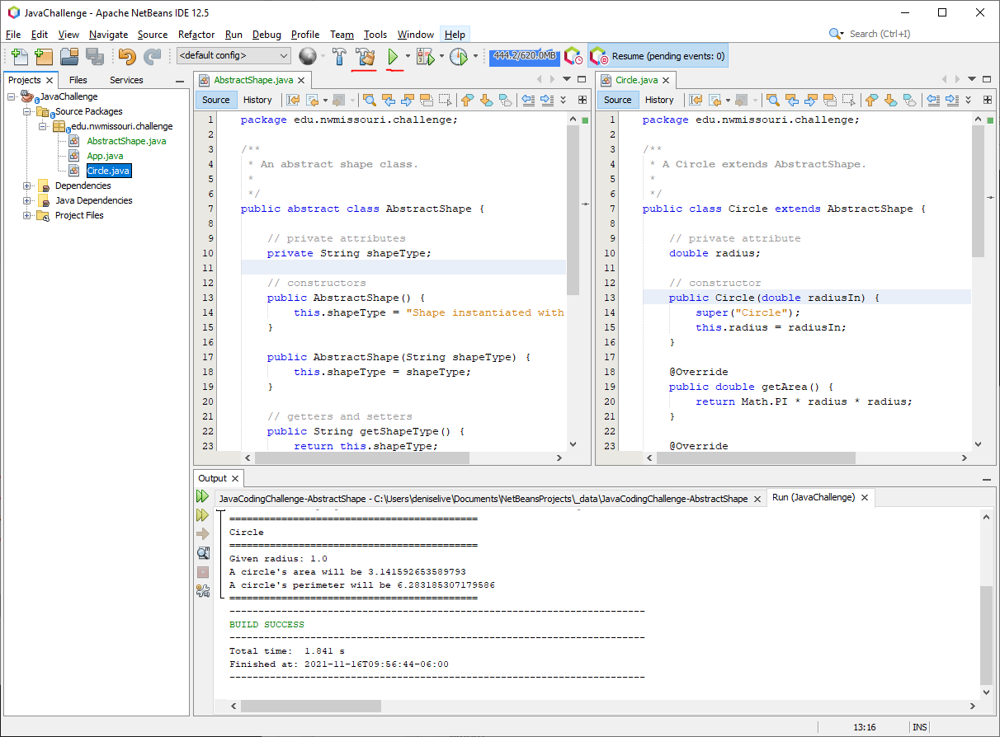
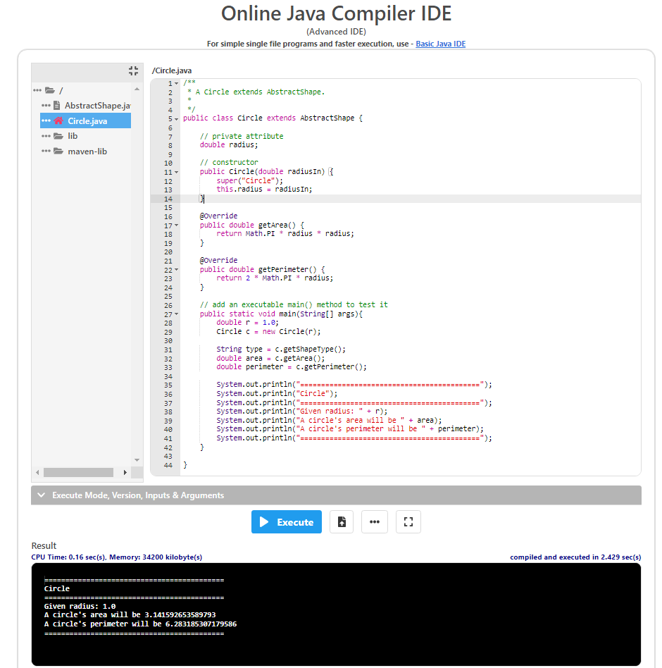

# JavaCodingChallenge-AbstractShape

Given this abstract superclass, plan and implement a more concrete subclass.

## Before Starting

- JDK 17 (if lower version, edit in pom.xml)
- Netbeans IDE
- Git
- TortoiseGit for Windows users

## Start the Challenge

- Fork the [repo](https://github.com/denisecase/JavaCodingChallenge-AbstractShape) into your GitHub account.
- Copy the url of your GitHub repo to your clipboard.
- Right-click on your machine / Git clone to get a local copy.
- Open Netbeans / Open project / navigate to your project folder.
- Right-click project / Clean and build.
- Right-click project / Run.

## Add a new Subclass

Once verified, use Netbeans to create a new concrete subclass.

- Rectangle would need length and width (or height).
- Square would need length.
- Circle uses radius.
- EquilateralTriangle would need length (all 3 sides are equal).

## Demo Your Class

- Instantiate your class
- Call its methods
- Output useful information to the user

## After Everything Works

- Git add your new class
- Git commit your changes
- Git push up to your repo

Share a link to your completed challenge in the cloud.

-----
Working in Netbeans

-----
Quick and Easy Alternative - JDoodle Online IDE

You can also complete the challenge using the online [JDoodle Advanced Java IDE](https://www.jdoodle.com/online-java-compiler-ide/).

- Create your files in the JDoodle online editor.
- Omit package statements at the top of each file.
- Use the 3 dots to the left of your new subclass to "Make it as start file".

